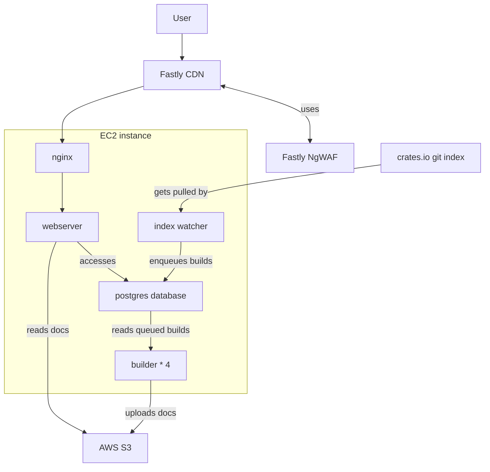

# legacy infrastructure

Here's a simplified graph of the different moving pieces.

## Fastly CDN

In the CDN, we run a
[Fastly compute WASM module](https://www.fastly.com/documentation/guides/compute/developer-guides/rust/),
the code lives in our
[`simpleinfra` repo](https://github.com/rust-lang/simpleinfra/tree/master/terraform/docs-rs/fastly-compute-docs-rs).

This enables us to move performance critical logic to the edge, and allows
writing integration tests for it.

The Fastly service
[if configured via Terraform in the same
repo](https://github.com/rust-lang/simpleinfra/blob/master/terraform/docs-rs/fastly.tf)

What content to cache or not is purely defined in the `Cache-Control` headers
that our webserver returns. There should not be any cache rules in the CDN
module. Also for now we don't want any business logic in the CDN, so the
webserver is easier to test & manage.

We also use the
[Fastly origin shield](https://www.fastly.com/documentation/guides/getting-started/hosts/shielding/)
to reduce load on our webservers.

### changes & deployment

Changes are typically done by us in
[the `simpleinfra` repo](https://github.com/rust-lang/simpleinfra/tree/master/terraform/docs-rs/),
and then reviewed & _manually_ applied by the infra-team.

## Fastly NgWAF

We also use the
[Fastly Web-Application firewall (NgWAF)](https://www.fastly.com/documentation/guides/next-gen-waf/).
It's integrated with the WASM module above, so all blocking happens in the CDN
and no malicious request will reach our origin servers.

When something is blocked, the user will see one of

- status `406 NOT ACCEPTABLE` for normal security rules
- status `429 Too Many Requests` for rate limiting.

_These status codes are only used in the NgWAF, so if a user sees them, the
NgWAF is the actor blocking the request._

### changes & deployment

The integration between the Fastly CDN & NgWAF lives in
[our compute WASM module](https://github.com/rust-lang/simpleinfra/tree/master/terraform/docs-rs/fastly-compute-docs-rs/src/ngwaf.rs).

In the legacy architecture, the rules are defined manually in the
[Signal Sciences Dashboard](https://dashboard.signalsciences.net/). With the
planned new infrastructure we'll start managing these in Terraform too.

_New or updated rules are typically distributed & active across Fastly's CDN in
< 1 min, sometimes 2-3 minutes._

## EC2 instance

Most of docs.rs' legacy infrastructure runs on a single huge EC2 instance.

That includes:

- nginx
- webserver
- index watcher
- build servers (4 at the time of writing)

### deployment

- ssh into the docs.rs server via bastion
- run `docs_rs_admin  build lock` to lock the build queue
- check [the build queue](https://docs.rs/releases/queue) until there are no
  in-progress builds any more.
- run the `deploy-docs.rs` bash script.
- if you update content that is typically cached, you need to run
  `docs_rs_admin cdn purge all`
- `docs_rs_admin build unlock` to continue builds

`deploy-docs.rs` will

- `git tag` the old `HEAD` as the previous release
- `git pull` the repo,
- run a build,
- copy the binaries
- restart the systemd services
- run database migrations
- purge the CDN for in-repo static content

There is also a `revert-docs.rs` script that reverts to the old tagged release.
_It doesn't reverting database migrations._

## Nginx

In the old infra, it does:

- act as reverse proxy to our webserver
- compresses content
- authenticates with the CDN.

Before we had the NgWAF, it also handled our rate-limiting.

### changes & deployment

Changes are done manually locally on the server (in `/etc/nginx/`), nginx then
normally restarted via systemd.

## Webserver

Our webserver.

- code lives
  [in the `docs_rs_web` subcrate](https://github.com/rust-lang/docs.rs/tree/main/crates/bin/docs_rs_web)
- is based on [the `axum` crate](https://docs.rs/axum/latest/axum/)

Next to some static and database content, it acts as a proxy to the stored
rustdoc HTML files, rewriting the HTML on the fly to make it match our UI.

## Index-watcher

A small process that manages a clone of the
[`crates.io-index` repo](https://github.com/rust-lang/crates.io-index).

We update it once a minute, and use
[`crates-index-diff`](https://docs.rs/crates-index-diff/latest/crates_index_diff/)
to determine the changes.

Depending on the event, we will:

- add the release to the build queue,
- update the yank status of the release, or
- delete the crate or release completely.

The code lives
[in the `docs_rs_watcher` subcrate](https://github.com/rust-lang/docs.rs/tree/main/crates/bin/docs_rs_watcher)

## Builder

The build-servers will

- read releases from the build queue,
- use [`rustwide`](https://docs.rs/rustwide/latest/rustwide/) to run
  `cargo
doc`, isolating the build in docker containers for security.
- package the docs into ZIP-File, and upload it to S3.

Currently we run **4** parallel build-servers.

The code lives
[in the `docs_rs_builder` subcrate](https://github.com/rust-lang/docs.rs/tree/main/crates/bin/docs_rs_builder)
