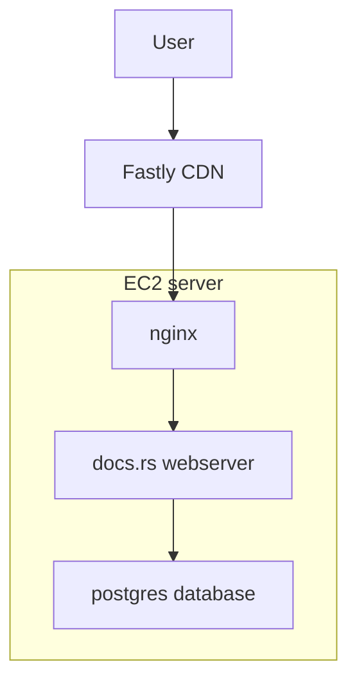

# legacy infrastructure

```mermaid
flowchart TD
  user[User] --> fastly[Fastly CDN]

  subgraph ec2[EC2 server]
    nginx[nginx] --> web[docs.rs webserver] --> psql[postgres database]
  end

  fastly --> nginx
```
