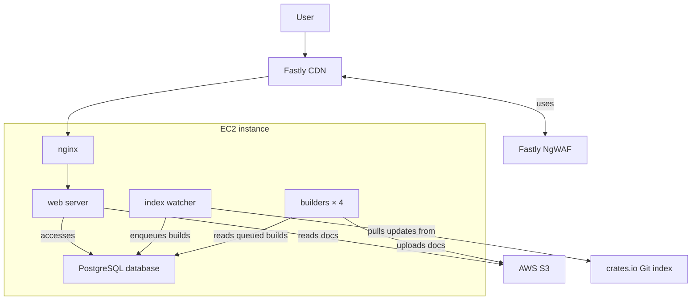

# Legacy Infrastructure

Here is a simplified diagram of the different moving pieces.

## Fastly CDN

Within the CDN, we run a
[Fastly Compute WASM module](https://www.fastly.com/documentation/guides/compute/developer-guides/rust/).
The code lives in our
[`simpleinfra` repository](https://github.com/rust-lang/simpleinfra/tree/master/terraform/docs-rs/fastly-compute-docs-rs).

This enables us to move performance-critical logic to the edge and write
integration tests for it.

[The Fastly service is configured via Terraform in the same
repository](https://github.com/rust-lang/simpleinfra/blob/master/terraform/docs-rs/fastly.tf).

What content is cached is defined solely by the `Cache-Control` headers that our
web server returns. There should not be any cache rules in the CDN module. For
now, we also don't want any business logic in the CDN, which makes the web
server easier to test and manage.

We also use the
[Fastly origin shield](https://www.fastly.com/documentation/guides/getting-started/hosts/shielding/)
to reduce the load on our web servers.

### Changes and Deployment

We typically make changes in
[the `simpleinfra` repository](https://github.com/rust-lang/simpleinfra/tree/master/terraform/docs-rs/),
after which they are reviewed and _manually_ applied by the infrastructure team.

## Fastly NgWAF

We also use the
[Fastly Web Application Firewall (NgWAF)](https://www.fastly.com/documentation/guides/next-gen-waf/).
It's integrated with the WASM module above, so all blocking happens in the CDN
and no malicious requests reach our origin servers.

When something is blocked, the user will see one of the following:

- status `406 NOT ACCEPTABLE` for normal security rules, or
- status `429 Too Many Requests` for rate limiting.

_These status codes are only used by the NgWAF, so if a user sees one, the
NgWAF is the component blocking the request._

### Changes and Deployment

The integration between the Fastly CDN and NgWAF is implemented in
[our Compute WASM module](https://github.com/rust-lang/simpleinfra/tree/master/terraform/docs-rs/fastly-compute-docs-rs/src/ngwaf.rs).

In the legacy architecture, the rules are defined manually in the
[Signal Sciences dashboard](https://dashboard.signalsciences.net/). With the
planned new infrastructure, we'll start managing these in Terraform as well.

_New or updated rules are typically distributed and active across Fastly's CDN
within one minute, though it can sometimes take two to three minutes._

## EC2 Instance

Most of the legacy docs.rs infrastructure runs on a single large EC2 instance.

That includes:

- nginx
- web server
- index watcher
- build servers (four at the time of writing)

### Deployment

- SSH into the docs.rs server through the bastion host.
- Run `docs_rs_admin build lock` to lock the build queue.
- Check [the build queue](https://docs.rs/releases/queue) until no builds are in
  progress.
- Run the `deploy-docs.rs` Bash script.
- If you update content that is typically cached, run
  `docs_rs_admin cdn purge all`.
- Run `docs_rs_admin build unlock` to resume builds.

`deploy-docs.rs` will:

- tag the old `HEAD` as the previous release with `git tag`,
- pull the repository with `git pull`,
- run a build,
- copy the binaries,
- restart the systemd services,
- run database migrations, and
- purge the CDN of static content stored in the repository.

There is also a `revert-docs.rs` script that reverts to the previously tagged
release. _It doesn't revert database migrations._

## Nginx

Nginx:

- acts as a reverse proxy to our web server,
- compresses content, and
- authenticates with the CDN.

Before we had the NgWAF, nginx also handled rate limiting and IP blocking during
attacks.

### Changes and Deployment

Changes are made manually on the server in `/etc/nginx/`, after which nginx must
be restarted via systemd.

## Web Server

Our web server:

- lives
  [in the `docs_rs_web` subcrate](https://github.com/rust-lang/docs.rs/tree/main/crates/bin/docs_rs_web),
  and
- is based on [the `axum` crate](https://docs.rs/axum/latest/axum/).

Besides serving some static and database-backed content, it acts as a proxy for
the stored rustdoc HTML files, rewriting them on the fly to match our UI.

Because we recompress and rewrite HTML for many requests, we're more CPU-bound
than a typical web server.

## Index Watcher

The index watcher is a small process that manages a clone of the
[`crates.io-index` repository](https://github.com/rust-lang/crates.io-index).

We update it once a minute and use
[`crates-index-diff`](https://docs.rs/crates-index-diff/latest/crates_index_diff/)
to determine the changes.

Depending on the change, we:

- add the release to the build queue,
- update the release's yanked status, or
- delete the crate or release entirely from our storage.

The code lives
[in the `docs_rs_watcher` subcrate](https://github.com/rust-lang/docs.rs/tree/main/crates/bin/docs_rs_watcher).

## Builder

The build servers:

- read releases from the build queue,
- use [`rustwide`](https://docs.rs/rustwide/latest/rustwide/) to run
  `cargo doc`, isolating each build in a Docker container for security, and
- package the documentation into a ZIP file and upload it to S3.

We currently run **four** parallel build servers.

The code lives
[in the `docs_rs_builder` subcrate](https://github.com/rust-lang/docs.rs/tree/main/crates/bin/docs_rs_builder).
