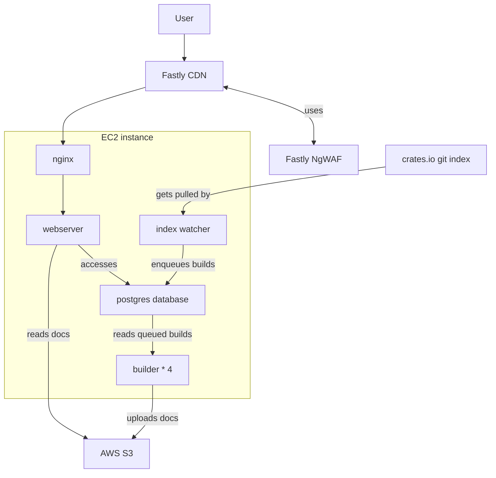

# legacy infrastructure

Here's a simplified graph of the different moving pieces.

```mermaid
flowchart TD
  user[User] --> fastly[Fastly CDN]
  fastly <--> |uses| ngwaf[Fastly NgWAF]

  subgraph ec2[EC2 instance]
    nginx[nginx] --> web[webserver] --> |accesses| psql[postgres database]
    watcher[index watcher] --> |enqueues builds| psql
    psql --> |reads queued builds| builder[builder * 4]
  end

  fastly --> nginx
  web -->|reads docs| s3[AWS S3]
  builder --> |uploads docs| s3

  index[crates.io git index] --> |gets pulled by| watcher
```
