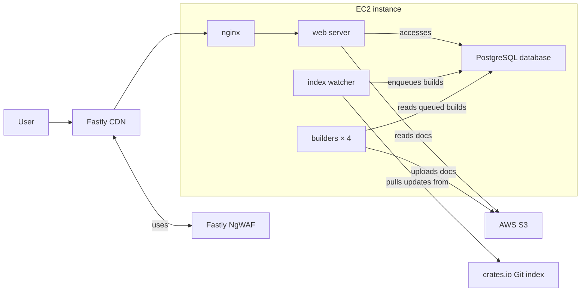

# Legacy Infrastructure

Here is a simplified diagram of the different moving pieces.

## Fastly CDN

The Fastly CDN caches responses from docs.rs and runs our Compute module at the
edge. It integrates with the [Fastly NgWAF](ngwaf.md) to block malicious
requests at the CDN level before they reach our origin servers.

See [Fastly CDN](fastly-cdn.md) for implementation and deployment details.

## Fastly NgWAF

Fastly's Web Application Firewall filters malicious requests at the CDN before
they reach our origin servers. See [Fastly NgWAF](ngwaf.md) for integration,
rules, and deployment details.

## EC2 Instance

Most of the legacy docs.rs infrastructure runs on a single large EC2 instance.

That includes:

- nginx
- web server
- index watcher
- build servers (four at the time of writing)

### Deployment

- SSH into the docs.rs server through the bastion host.
- Run `docs_rs_admin build lock` to lock the build queue.
- Check [the build queue](https://docs.rs/releases/queue) until no builds are in
  progress.
- Run the `deploy-docs.rs` Bash script.
- If you update content that is typically cached, run
  `docs_rs_admin cdn purge all`.
- Run `docs_rs_admin build unlock` to resume builds.

`deploy-docs.rs` will:

- tag the old `HEAD` as the previous release with `git tag`,
- pull the repository with `git pull`,
- run a build,
- copy the binaries,
- restart the systemd services,
- run database migrations, and
- purge the CDN of static content stored in the repository.

There is also a `revert-docs.rs` script that reverts to the previously tagged
release. _It doesn't revert database migrations._

## Nginx

Nginx:

- acts as a reverse proxy to our web server,
- compresses content, and
- authenticates with the CDN.

Before we had the NgWAF, nginx also handled rate limiting and IP blocking during
attacks.

### Changes and Deployment

Changes are made manually on the server in `/etc/nginx/`, after which nginx must
be restarted via systemd.

## Web Server

The web server handles requests from nginx and serves docs.rs content. See
[Web Server](../services/web-server.md) for implementation details.

## Index Watcher

The index watcher monitors the crates.io index and updates the build queue and
stored releases. See [Index Watcher](../services/index-watcher.md) for
implementation details.

## Build Servers

The build servers generate documentation for queued releases and upload it to
S3. See [Build Server](../services/build-server.md) for implementation details.
