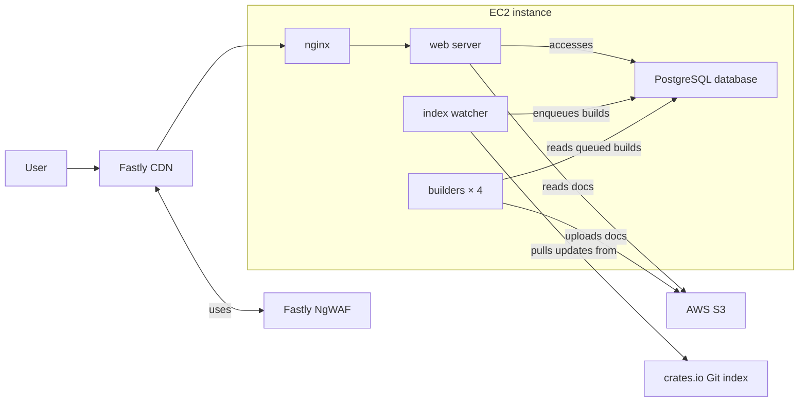

# Legacy Infrastructure

Here is a simplified diagram of the different moving pieces.

## Fastly CDN

The Fastly CDN caches responses from docs.rs and runs our Compute module at the
edge. It integrates with the [Fastly NgWAF](../ngwaf.md) to block malicious
requests.

See [Fastly CDN](../fastly-cdn.md) for implementation and deployment details.

## Fastly NgWAF

Fastly's Web Application Firewall filters malicious requests at the CDN before
they reach our origin servers. See [Fastly NgWAF](../ngwaf.md) for integration,
rules, and deployment details.

## EC2 Instance

Most of the legacy docs.rs infrastructure runs on a single large EC2 instance,
including the following services:

- nginx
- web server
- index watcher
- build servers
- postgresql database

## Nginx

Nginx:

- acts as a reverse proxy to our web server,
- compresses content, and
- authenticates with the CDN.

See [Nginx](nginx.md) for configuration and deployment details.

## Web Server

The web server handles requests from nginx and serves docs.rs content. See
[Web Server](../../binaries/web-server.md) for implementation details.

## Index Watcher

The index watcher monitors the crates.io index and updates the build queue and
stored releases. See [Index Watcher](../../binaries/index-watcher.md) for
implementation details.

## Build Servers

The build servers generate documentation for queued releases and upload it to
S3. See [Build Server](../../binaries/build-server/index.md) for implementation
details.

We currently run **four** parallel build servers.

## PostgreSQL database

The database server runs locally on the EC2 instance. Currently we run postgres
v10.

We have a `psql` wrapper script that directly connects to our database.

## S3

We use S3 for object storage.

The service accesses S3 using the IAM role attached to the EC2 instance through
its instance profile. The AWS SDK automatically obtains temporary credentials
through IMDS.
